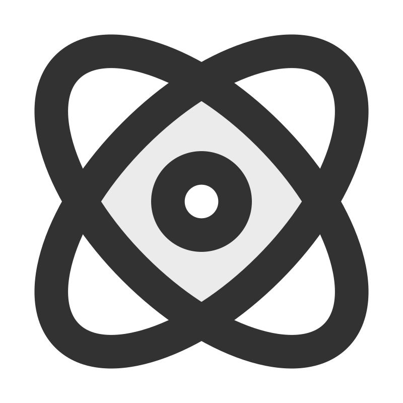

<!-- markdownlint-disable MD033 -->
<strong>English</strong> <small>(current)</small> · <a href="./README_es.md" title="Leer en Español">Español</a>
<br>
<br>
<details>
  <summary><span style="display:inline-flex;align-items:center;gap:8px;line-height:1;"><picture style="display:inline-block;margin:0">
    <source media="(prefers-color-scheme: dark)" srcset="assets/programming-code-signs-svgrepo-com-white.svg">
    <source media="(prefers-color-scheme: light)" srcset="assets/programming-code-signs-svgrepo-com.svg">
    
  </picture><picture style="display:inline-block;margin:0">
    <source media="(prefers-color-scheme: dark)" srcset="assets/summary-projects-white.svg">
    <source media="(prefers-color-scheme: light)" srcset="assets/summary-projects.svg">
    
  </picture></span></summary>

  <br>
  <table>
    <tbody>
      <tr>
        <td>
          <em><strong><a href="https://github.com/diegokoes/hsn-angular-node">HSN-Store</a></strong></em>
        </td>
        <td>
          
          <picture style="display:inline-block;margin:0">
            <source media="(prefers-color-scheme: dark)" srcset="https://cdn.simpleicons.org/express/ffffff">
            <source media="(prefers-color-scheme: light)" srcset="https://cdn.simpleicons.org/express/000000">
            
          </picture>
          
        </td>
      </tr>
      <tr>
        <td>
          <em><strong><a href="https://github.com/diegokoes/hsn-react-node">HSN-Store</a></strong></em>
        </td>
        <td>
          
          <picture style="display:inline-block;margin:0">
            <source media="(prefers-color-scheme: dark)" srcset="https://cdn.simpleicons.org/express/ffffff">
            <source media="(prefers-color-scheme: light)" srcset="https://cdn.simpleicons.org/express/000000">
            
          </picture>
          
        </td>
      </tr>
  </tbody>
  </table>
</details>
<details>
  <summary><span style="display:inline-flex;align-items:center;gap:8px;line-height:1;"><picture style="display:inline-block;margin:0">
    <source media="(prefers-color-scheme: dark)" srcset="assets/course-svgrepo-com-white.svg">
    <source media="(prefers-color-scheme: light)" srcset="assets/course-svgrepo-com.svg">
    
  </picture><picture style="display:inline-block;margin:0">
    <source media="(prefers-color-scheme: dark)" srcset="assets/summary-courses-white.svg">
    <source media="(prefers-color-scheme: light)" srcset="assets/summary-courses.svg">
    
  </picture></span></summary>

  <br>
  <table>
    <tr><th align="left">Course</th><th align="left">Hours</th><th align="left">Description</th><th align="left">Status</th></tr>
    <tr><td colspan="4" align="left"><strong>Coursera</strong></td></tr>
    <tr><td><em><strong><a href="https://github.com/diegokoes/Courses/tree/main/Coursera/Meta_Backend_Certificate/">Meta Backend Certificate</a></strong></em></td><td>196</td><td>
    <small>Django - SQL - RESTful API design</small>
    </td><td>In Progress</td></tr>
    <tr><td colspan="4" align="left"><strong>Udemy</strong></td></tr>
    <tr><td><em><strong><a href="https://github.com/diegokoes/Courses/tree/main/Udemy/Angular_Complete_Guide">Angular — The Complete Guide</a></strong></em></td><td>56</td><td>Pipes, Dependency Injection, Observables, Forms, Databinding, Authentication, Protection, Signals, State Management...</td><td>In Progress</td></tr>
    <tr><td colspan="4" align="left"><strong>EDX</strong></td></tr>
    <tr><td><em><strong><a href="https://www.edx.org/certificates/professional-certificate/linuxfoundationx-introduction-to-devops-practices-and-tools?index=product&queryId=79fba2c89bd09f81a6401a4c57ef92ed&position=1">Certificate Introduction to DevOps: Practices and Tools</a></strong></em></td><td>48</td><td>SRE, IaC, Observability, Jenkins (jobs,security, pipeline...),Kubernetes and OpenFaaS </td><td>Complete</td></tr>
    <tr><td colspan="4" align="left"><strong><a href="https://github.com/diegokoes/Courses/tree/main/OpenWebinars">OpenWebinars</a></strong></td></tr>
  </table>
</details>
<details>
  <summary><span style="display:inline-flex;align-items:center;gap:8px;line-height:1;"><picture style="display:inline-block;margin:0">
    <source media="(prefers-color-scheme: dark)" srcset="assets/knowledge-graph-svgrepo-com-white.svg">
    <source media="(prefers-color-scheme: light)" srcset="assets/knowledge-graph-svgrepo-com.svg">
    
  </picture><picture style="display:inline-block;margin:0">
    <source media="(prefers-color-scheme: dark)" srcset="assets/summary-stack-white.svg">
    <source media="(prefers-color-scheme: light)" srcset="assets/summary-stack.svg">
    
  </picture></span></summary>
<br>
  <table>
    <tr>
      <td><strong>Frontend</strong></td>
      <td style="display:flex;gap:16px;align-items:center;flex-wrap:wrap;">
        <span style="display:inline-flex;align-items:center;gap:4px;">
          
          <picture style="display:inline-block;margin:0">
            <source media="(prefers-color-scheme: dark)" srcset="assets/tech-angular-white.svg">
            <source media="(prefers-color-scheme: light)" srcset="assets/tech-angular.svg">
            
          </picture>
        </span>
        <span style="display:inline-flex;align-items:center;gap:4px;">
          
          <picture style="display:inline-block;margin:0">
            <source media="(prefers-color-scheme: dark)" srcset="assets/tech-react-white.svg">
            <source media="(prefers-color-scheme: light)" srcset="assets/tech-react.svg">
            
          </picture>
        </span>
                <span style="display:inline-flex;align-items:center;gap:4px;">
          
          <picture style="display:inline-block;margin:0">
            <source media="(prefers-color-scheme: dark)" srcset="assets/tech-tailwindcss-white.svg">
            <source media="(prefers-color-scheme: light)" srcset="assets/tech-tailwindcss.svg">
            
          </picture>
        </span>
      </td>
    </tr>
    <tr>
      <td><strong>Backend</strong></td>
      <td style="display:flex;gap:12px;align-items:center;flex-wrap:wrap;">
        <span style="display:inline-flex;align-items:center;gap:4px;">
          <picture style="display:inline-block;margin:0">
            <source media="(prefers-color-scheme: dark)" srcset="https://cdn.simpleicons.org/express/ffffff">
            <source media="(prefers-color-scheme: light)" srcset="https://cdn.simpleicons.org/express/000000">
            
          </picture>
          <picture style="display:inline-block;margin:0">
            <source media="(prefers-color-scheme: dark)" srcset="assets/tech-express-white.svg">
            <source media="(prefers-color-scheme: light)" srcset="assets/tech-express.svg">
            
          </picture>
        </span>
        <span style="display:inline-flex;align-items:center;gap:4px;">
          
          <picture style="display:inline-block;margin:0">
            <source media="(prefers-color-scheme: dark)" srcset="assets/tech-nodejs-white.svg">
            <source media="(prefers-color-scheme: light)" srcset="assets/tech-nodejs.svg">
            
          </picture>
        </span>
        <span style="display:inline-flex;align-items:center;gap:4px;">
          
          <picture style="display:inline-block;margin:0">
            <source media="(prefers-color-scheme: dark)" srcset="assets/tech-spring-white.svg">
            <source media="(prefers-color-scheme: light)" srcset="assets/tech-spring.svg">
            
          </picture>
        </span>
        <span style="display:inline-flex;align-items:center;gap:4px;">
          
          <picture style="display:inline-block;margin:0">
            <source media="(prefers-color-scheme: dark)" srcset="assets/tech-django-white.svg">
            <source media="(prefers-color-scheme: light)" srcset="assets/tech-django.svg">
            
          </picture>
        </span>
      </td>
    </tr>
    <tr>
      <td><strong>Databases</strong></td>
      <td style="display:flex;gap:12px;align-items:center;flex-wrap:wrap;">
        <span style="display:inline-flex;align-items:center;gap:4px;">
          
          <picture style="display:inline-block;margin:0">
            <source media="(prefers-color-scheme: dark)" srcset="assets/tech-mongodb-white.svg">
            <source media="(prefers-color-scheme: light)" srcset="assets/tech-mongodb.svg">
            
          </picture>
        </span>
        <!-- <span style="display:inline-flex;align-items:center;gap:4px;">
          
          <picture style="display:inline-block;margin:0">
            <source media="(prefers-color-scheme: dark)" srcset="assets/tech-postgresql-white.svg">
            <source media="(prefers-color-scheme: light)" srcset="assets/tech-postgresql.svg">
            
          </picture>
        </span> -->
        <span style="display:inline-flex;align-items:center;gap:4px;">
          
          <picture style="display:inline-block;margin:0">
            <source media="(prefers-color-scheme: dark)" srcset="assets/tech-oracle-sql-white.svg">
            <source media="(prefers-color-scheme: light)" srcset="assets/tech-oracle-sql.svg">
            
          </picture>
        </span>
        <span style="display:inline-flex;align-items:center;gap:4px;">
          
          <picture style="display:inline-block;margin:0">
            <source media="(prefers-color-scheme: dark)" srcset="assets/tech-dbeaver-white.svg">
            <source media="(prefers-color-scheme: light)" srcset="assets/tech-dbeaver.svg">
            
          </picture>
        </span>
      </td>
    </tr>
    <tr>
      <td><strong>DevOps</strong></td>
      <td style="display:flex;gap:12px;align-items:center;flex-wrap:wrap;">
        <span style="display:inline-flex;align-items:center;gap:4px;">
          
          <picture style="display:inline-block;margin:0">
            <source media="(prefers-color-scheme: dark)" srcset="assets/tech-docker-white.svg">
            <source media="(prefers-color-scheme: light)" srcset="assets/tech-docker.svg">
            
          </picture>
        </span>
        <span style="display:inline-flex;align-items:center;gap:4px;">
          
          <picture style="display:inline-block;margin:0">
            <source media="(prefers-color-scheme: dark)" srcset="assets/tech-proxmox-white.svg">
            <source media="(prefers-color-scheme: light)" srcset="assets/tech-proxmox.svg">
            
          </picture>
        </span>
        <span style="display:inline-flex;align-items:center;gap:4px;">
          
          <picture style="display:inline-block;margin:0">
            <source media="(prefers-color-scheme: dark)" srcset="assets/tech-jenkins-white.svg">
            <source media="(prefers-color-scheme: light)" srcset="assets/tech-jenkins.svg">
            
          </picture>
        </span>
        <span style="display:inline-flex;align-items:center;gap:4px;">
          
          <picture style="display:inline-block;margin:0">
            <source media="(prefers-color-scheme: dark)" srcset="assets/tech-git-white.svg">
            <source media="(prefers-color-scheme: light)" srcset="assets/tech-git.svg">
            
          </picture>
        </span>
      </td>
    </tr>
  </table>
</details>

<details>
  <summary><span style="display:inline-flex;align-items:center;gap:8px;line-height:1;"><picture style="display:inline-block;margin:0">
    <source media="(prefers-color-scheme: dark)" srcset="assets/atom-svgrepo-com-white.svg">
    <source media="(prefers-color-scheme: light)" srcset="assets/atom-svgrepo-com.svg">
    
  </picture><picture style="display:inline-block;margin:0">
    <source media="(prefers-color-scheme: dark)" srcset="assets/summary-homelab-white.svg">
    <source media="(prefers-color-scheme: light)" srcset="assets/summary-homelab.svg">
    
  </picture></span></summary>
<br>
  <table>
    <tbody>
      <tr>
        <td>
          <strong><a href="https://github.com/diegokoes/proxmox">proxmox</a></strong>
        </td>
        <td>configs and docs for my Proxmox home server</td>
      </tr>
      <tr>
        <td>
          <strong><a href="https://github.com/diegokoes/dotfiles">dotfiles</a></strong>
        </td>
        <td>dotfiles and environment setup</td>
      </tr>
      <tr>
        <td>
          <strong><a href="https://github.com/diegokoes/NOTES_programming">obsidian_programming</a></strong>
        </td>
        <td>notes I make to organize my study of programming/tech in Obsidian</td>
      </tr>
      <tr>
        <td>
          <strong><a href="https://github.com/stars/diegokoes/lists/computer-installed">tools</a></strong>
        </td>
        <td>starred software & utilities repos that I use</td>
      </tr>
      <tr>
        <td>
          <strong><a href="https://github.com/stars/diegokoes/lists/wrench-interesting">interesting</a></strong>
        </td>
        <td>starred repos I find useful/interesting</td>
      </tr>
    </tbody>
  </table>
</details>

<details>
  <summary><span style="display:inline-flex;align-items:center;gap:8px;line-height:1;"><picture style="display:inline-block;margin:0">
    <source media="(prefers-color-scheme: dark)" srcset="assets/stats-chart-sharp-svgrepo-com-white.svg">
    <source media="(prefers-color-scheme: light)" srcset="assets/stats-chart-sharp-svgrepo-com.svg">
    
  </picture><picture style="display:inline-block;margin:0">
    <source media="(prefers-color-scheme: dark)" srcset="assets/summary-stats-white.svg">
    <source media="(prefers-color-scheme: light)" srcset="assets/summary-stats.svg">
    
  </picture></span></summary>
  <br>

<!--START_SECTION:waka-->
**I'm an Early 🐤** 

```text
🌞 Morning    42 commits     ██░░░░░░░░░░░░░░░░░░░░░░░   11.02% 
🌆 Daytime    156 commits    ██████████░░░░░░░░░░░░░░░   40.94% 
🌃 Evening    156 commits    ██████████░░░░░░░░░░░░░░░   40.94% 
🌙 Night      27 commits     █░░░░░░░░░░░░░░░░░░░░░░░░   7.09%

```


📊 **This Week I Spent My Time On** 

```text
⌚︎ Time Zone: Europe/Madrid

💬 Programming Languages: 
Markdown                 3 hrs 43 mins       ██████████████████░░░░░░░   72.8% 
Java                     47 mins             ████░░░░░░░░░░░░░░░░░░░░░   15.59% 
Other                    14 mins             █░░░░░░░░░░░░░░░░░░░░░░░░   4.86% 
Bash                     4 mins              ░░░░░░░░░░░░░░░░░░░░░░░░░   1.48% 
JavaScript               4 mins              ░░░░░░░░░░░░░░░░░░░░░░░░░   1.45%

🔥 Editors: 
Obsidian                 3 hrs 43 mins       ██████████████████░░░░░░░   72.79% 
IntelliJ IDEA            51 mins             ████░░░░░░░░░░░░░░░░░░░░░   16.89% 
VS Code                  31 mins             ██░░░░░░░░░░░░░░░░░░░░░░░   10.32%

🐱‍💻 Projects: 
obsidian_programming     3 hrs 43 mins       ██████████████████░░░░░░░   72.79% 
A_FoodExpressAPI_II      46 mins             ███░░░░░░░░░░░░░░░░░░░░░░   15.27% 
dotfiles                 19 mins             █░░░░░░░░░░░░░░░░░░░░░░░░   6.36% 
Advent-of-Code           8 mins              ░░░░░░░░░░░░░░░░░░░░░░░░░   2.66% 
hsn-angular-node         4 mins              ░░░░░░░░░░░░░░░░░░░░░░░░░   1.3%

💻 Operating System: 
Linux                    5 hrs 7 mins        █████████████████████████   100.0%

```

**I Mostly Code in Python** 

```text
Python                   4 repos             ███████░░░░░░░░░░░░░░░░░░   30.77% 
HTML                     3 repos             █████░░░░░░░░░░░░░░░░░░░░   23.08% 
JavaScript               2 repos             ███░░░░░░░░░░░░░░░░░░░░░░   15.38% 
Java                     2 repos             ███░░░░░░░░░░░░░░░░░░░░░░   15.38% 
SCSS                     1 repo              ██░░░░░░░░░░░░░░░░░░░░░░░   7.69%

```


 Last Updated on 16/12/2025
<!--END_SECTION:waka-->
</details>

<small>If you need to contact me, message me on <strong>Discord</strong> (@__koes) or via <strong>Email</strong> at <code>diegomanrique.dev@pm.me</code></small>
