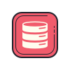
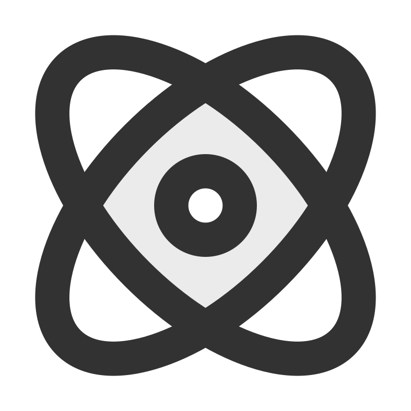

<!-- markdownlint-disable MD033 -->
<strong>English</strong> <small>(current)</small> · <a href="./README_es.md" title="Leer en Español">Español</a>
<br>
<br>
<details>
  <summary><span style="display:inline-flex;align-items:center;gap:8px;line-height:1;"><picture style="display:inline-block;margin:0">
    <source media="(prefers-color-scheme: dark)" srcset="assets/programming-code-signs-svgrepo-com-white.svg">
    <source media="(prefers-color-scheme: light)" srcset="assets/programming-code-signs-svgrepo-com.svg">
    
  </picture><picture style="display:inline-block;margin:0">
    <source media="(prefers-color-scheme: dark)" srcset="assets/summary-projects-white.svg">
    <source media="(prefers-color-scheme: light)" srcset="assets/summary-projects.svg">
    
  </picture></span></summary>

  <br>
  <table>
    <tbody>
      <tr>
        <td>
          <em><strong>Parallax-Sports</strong></em>
        </td>
        <td>
          <a href="https://tfg-avellaneda-25-26.github.io/parallax-sports-docs/">DOCS</a>
        </td>
      </tr>
  </tbody>
  </table>
</details>
<details>
  <summary><span style="display:inline-flex;align-items:center;gap:8px;line-height:1;"><picture style="display:inline-block;margin:0">
    <source media="(prefers-color-scheme: dark)" srcset="assets/course-svgrepo-com-white.svg">
    <source media="(prefers-color-scheme: light)" srcset="assets/course-svgrepo-com.svg">
    
  </picture><picture style="display:inline-block;margin:0">
    <source media="(prefers-color-scheme: dark)" srcset="assets/summary-courses-white.svg">
    <source media="(prefers-color-scheme: light)" srcset="assets/summary-courses.svg">
    
  </picture></span></summary>

  <br>
  <table>
    <tr><th align="left">Course</th><th align="left">Hours</th><th align="left">Description</th><th align="left">Status</th></tr>
    <tr><td colspan="4" align="left"><strong>Coursera</strong></td></tr>
    <tr><td><em><strong><a href="https://github.com/diegokoes/Courses/tree/main/Coursera/Meta_Backend_Certificate/">Meta Backend Certificate</a></strong></em></td><td>196</td><td>
    <small>Django - SQL - RESTful API design</small>
    </td><td>In Progress</td></tr>
    <tr><td colspan="4" align="left"><strong>Udemy</strong></td></tr>
    <tr><td><em><strong><a href="https://github.com/diegokoes/Courses/tree/main/Udemy/Angular_Complete_Guide">Angular — The Complete Guide</a></strong></em></td><td>56</td><td>Pipes, Dependency Injection, Observables, Forms, Databinding, Authentication, Protection, Signals, State Management...</td><td>In Progress</td></tr>
    <tr><td colspan="4" align="left"><strong>EDX</strong></td></tr>
    <tr><td><em><strong><a href="https://www.edx.org/certificates/professional-certificate/linuxfoundationx-introduction-to-devops-practices-and-tools?index=product&queryId=79fba2c89bd09f81a6401a4c57ef92ed&position=1">Certificate Introduction to DevOps: Practices and Tools</a></strong></em></td><td>48</td><td>SRE, IaC, Observability, Jenkins (jobs,security, pipeline...),Kubernetes and OpenFaaS </td><td>Complete</td></tr>
    <tr><td colspan="4" align="left"><strong><a href="https://github.com/diegokoes/Courses/tree/main/OpenWebinars">OpenWebinars</a></strong></td></tr>
  </table>
</details>
<details>
  <summary><span style="display:inline-flex;align-items:center;gap:8px;line-height:1;"><picture style="display:inline-block;margin:0">
    <source media="(prefers-color-scheme: dark)" srcset="assets/knowledge-graph-svgrepo-com-white.svg">
    <source media="(prefers-color-scheme: light)" srcset="assets/knowledge-graph-svgrepo-com.svg">
    
  </picture><picture style="display:inline-block;margin:0">
    <source media="(prefers-color-scheme: dark)" srcset="assets/summary-stack-white.svg">
    <source media="(prefers-color-scheme: light)" srcset="assets/summary-stack.svg">
    
  </picture></span></summary>
<br>
  <table>
    <tr>
      <td><strong>Frontend</strong></td>
      <td><table border="0" cellspacing="0"><tr>
        <td width="170"><span style="display:inline-flex;align-items:center;gap:4px;">
          
          <picture style="display:inline-block;margin:0">
            <source media="(prefers-color-scheme: dark)" srcset="assets/tech-angular-white.svg">
            <source media="(prefers-color-scheme: light)" srcset="assets/tech-angular.svg">
            
          </picture>
        </span></td>
        <td width="170"><span style="display:inline-flex;align-items:center;gap:4px;">
          
          <picture style="display:inline-block;margin:0">
            <source media="(prefers-color-scheme: dark)" srcset="assets/tech-react-white.svg">
            <source media="(prefers-color-scheme: light)" srcset="assets/tech-react.svg">
            
          </picture>
        </span></td>
        <td width="170"><span style="display:inline-flex;align-items:center;gap:4px;">
          
          <picture style="display:inline-block;margin:0">
            <source media="(prefers-color-scheme: dark)" srcset="assets/tech-gsap-white.svg">
            <source media="(prefers-color-scheme: light)" srcset="assets/tech-gsap.svg">
            
          </picture>
        </span></td>
      </tr></table></td>
    </tr>
    <tr>
      <td><strong>Backend</strong></td>
      <td><table border="0" cellspacing="0"><tr>
        <td width="170"><span style="display:inline-flex;align-items:center;gap:4px;">
          <picture style="display:inline-block;margin:0">
            <source media="(prefers-color-scheme: dark)" srcset="https://cdn.simpleicons.org/express/ffffff">
            <source media="(prefers-color-scheme: light)" srcset="https://cdn.simpleicons.org/express/000000">
            
          </picture>
          <picture style="display:inline-block;margin:0">
            <source media="(prefers-color-scheme: dark)" srcset="assets/tech-express-white.svg">
            <source media="(prefers-color-scheme: light)" srcset="assets/tech-express.svg">
            
          </picture>
        </span></td>
        <td width="170"><span style="display:inline-flex;align-items:center;gap:4px;">
          
          <picture style="display:inline-block;margin:0">
            <source media="(prefers-color-scheme: dark)" srcset="assets/tech-nodejs-white.svg">
            <source media="(prefers-color-scheme: light)" srcset="assets/tech-nodejs.svg">
            
          </picture>
        </span></td>
        <td width="170"><span style="display:inline-flex;align-items:center;gap:4px;">
          
          <picture style="display:inline-block;margin:0">
            <source media="(prefers-color-scheme: dark)" srcset="assets/tech-spring-white.svg">
            <source media="(prefers-color-scheme: light)" srcset="assets/tech-spring.svg">
            
          </picture>
        </span></td>
        <td width="170"><span style="display:inline-flex;align-items:center;gap:4px;">
          
          <picture style="display:inline-block;margin:0">
            <source media="(prefers-color-scheme: dark)" srcset="assets/tech-django-white.svg">
            <source media="(prefers-color-scheme: light)" srcset="assets/tech-django.svg">
            
          </picture>
        </span></td>
      </tr></table></td>
    </tr>
    <tr>
      <td><strong>Databases</strong></td>
      <td><table border="0" cellspacing="0"><tr>
        <td width="170"><span style="display:inline-flex;align-items:center;gap:4px;">
          
          <picture style="display:inline-block;margin:0">
            <source media="(prefers-color-scheme: dark)" srcset="assets/tech-mongodb-white.svg">
            <source media="(prefers-color-scheme: light)" srcset="assets/tech-mongodb.svg">
            
          </picture>
        </span></td>
        <!-- <td width="170"><span style="display:inline-flex;align-items:center;gap:4px;">
          
          <picture style="display:inline-block;margin:0">
            <source media="(prefers-color-scheme: dark)" srcset="assets/tech-postgresql-white.svg">
            <source media="(prefers-color-scheme: light)" srcset="assets/tech-postgresql.svg">
            
          </picture>
        </span></td> -->
        <td width="170"><span style="display:inline-flex;align-items:center;gap:4px;">
          
          <picture style="display:inline-block;margin:0">
            <source media="(prefers-color-scheme: dark)" srcset="assets/tech-oracle-sql-white.svg">
            <source media="(prefers-color-scheme: light)" srcset="assets/tech-oracle-sql.svg">
            
          </picture>
        </span></td>
        <td width="170"><span style="display:inline-flex;align-items:center;gap:4px;">
          
          <picture style="display:inline-block;margin:0">
            <source media="(prefers-color-scheme: dark)" srcset="assets/tech-dbeaver-white.svg">
            <source media="(prefers-color-scheme: light)" srcset="assets/tech-dbeaver.svg">
            
          </picture>
        </span></td>
      </tr></table></td>
    </tr>
    <tr>
      <td><strong>DevOps</strong></td>
      <td><table border="0" cellspacing="0"><tr>
        <td width="170"><span style="display:inline-flex;align-items:center;gap:4px;">
          
          <picture style="display:inline-block;margin:0">
            <source media="(prefers-color-scheme: dark)" srcset="assets/tech-docker-white.svg">
            <source media="(prefers-color-scheme: light)" srcset="assets/tech-docker.svg">
            
          </picture>
        </span></td>
        <td width="170"><span style="display:inline-flex;align-items:center;gap:4px;">
          
          <picture style="display:inline-block;margin:0">
            <source media="(prefers-color-scheme: dark)" srcset="assets/tech-proxmox-white.svg">
            <source media="(prefers-color-scheme: light)" srcset="assets/tech-proxmox.svg">
            
          </picture>
        </span></td>
        <td width="170"><span style="display:inline-flex;align-items:center;gap:4px;">
          
          <picture style="display:inline-block;margin:0">
            <source media="(prefers-color-scheme: dark)" srcset="assets/tech-jenkins-white.svg">
            <source media="(prefers-color-scheme: light)" srcset="assets/tech-jenkins.svg">
            
          </picture>
        </span></td>
        <td width="170"><span style="display:inline-flex;align-items:center;gap:4px;">
          
          <picture style="display:inline-block;margin:0">
            <source media="(prefers-color-scheme: dark)" srcset="assets/tech-git-white.svg">
            <source media="(prefers-color-scheme: light)" srcset="assets/tech-git.svg">
            
          </picture>
        </span></td>
      </tr></table></td>
    </tr>
    <tr>
      <td><strong>Observability</strong></td>
      <td><table border="0" cellspacing="0"><tr>
        <td width="170"><span style="display:inline-flex;align-items:center;gap:4px;">
          
          <picture style="display:inline-block;margin:0">
            <source media="(prefers-color-scheme: dark)" srcset="assets/tech-prometheus-white.svg">
            <source media="(prefers-color-scheme: light)" srcset="assets/tech-prometheus.svg">
            
          </picture>
        </span></td>
        <td width="170"><span style="display:inline-flex;align-items:center;gap:4px;">
          
          <picture style="display:inline-block;margin:0">
            <source media="(prefers-color-scheme: dark)" srcset="assets/tech-grafana-white.svg">
            <source media="(prefers-color-scheme: light)" srcset="assets/tech-grafana.svg">
            
          </picture>
        </span></td>
        <td width="170"><span style="display:inline-flex;align-items:center;gap:4px;">
          
          <picture style="display:inline-block;margin:0">
            <source media="(prefers-color-scheme: dark)" srcset="assets/tech-loki-white.svg">
            <source media="(prefers-color-scheme: light)" srcset="assets/tech-loki.svg">
            
          </picture>
        </span></td>
        <td width="170"><span style="display:inline-flex;align-items:center;gap:4px;">
          
          <picture style="display:inline-block;margin:0">
            <source media="(prefers-color-scheme: dark)" srcset="assets/tech-k6-white.svg">
            <source media="(prefers-color-scheme: light)" srcset="assets/tech-k6.svg">
            
          </picture>
        </span></td>
      </tr></table></td>
    </tr>
  </table>
</details>

<details>
  <summary><span style="display:inline-flex;align-items:center;gap:8px;line-height:1;"><picture style="display:inline-block;margin:0">
    <source media="(prefers-color-scheme: dark)" srcset="assets/atom-svgrepo-com-white.svg">
    <source media="(prefers-color-scheme: light)" srcset="assets/atom-svgrepo-com.svg">
    
  </picture><picture style="display:inline-block;margin:0">
    <source media="(prefers-color-scheme: dark)" srcset="assets/summary-homelab-white.svg">
    <source media="(prefers-color-scheme: light)" srcset="assets/summary-homelab.svg">
    
  </picture></span></summary>
<br>
  <table>
    <tbody>
      <tr>
        <td>
          <strong><a href="https://github.com/diegokoes/proxmox">proxmox</a></strong>
        </td>
        <td>configs and docs for my Proxmox home server</td>
      </tr>
      <tr>
        <td>
          <strong><a href="https://github.com/diegokoes/dotfiles">dotfiles</a></strong>
        </td>
        <td>dotfiles and environment setup</td>
      </tr>
      <tr>
        <td>
          <strong><a href="https://github.com/diegokoes/NOTES_programming">obsidian_programming</a></strong>
        </td>
        <td>notes I make to organize my study of programming/tech in Obsidian</td>
      </tr>
      <tr>
        <td>
          <strong><a href="https://github.com/stars/diegokoes/lists/computer-installed">tools</a></strong>
        </td>
        <td>starred software & utilities repos that I use</td>
      </tr>
      <tr>
        <td>
          <strong><a href="https://github.com/stars/diegokoes/lists/wrench-interesting">interesting</a></strong>
        </td>
        <td>starred repos I find useful/interesting</td>
      </tr>
    </tbody>
  </table>
</details>

<details>
  <summary><span style="display:inline-flex;align-items:center;gap:8px;line-height:1;"><picture style="display:inline-block;margin:0">
    <source media="(prefers-color-scheme: dark)" srcset="assets/stats-chart-sharp-svgrepo-com-white.svg">
    <source media="(prefers-color-scheme: light)" srcset="assets/stats-chart-sharp-svgrepo-com.svg">
    
  </picture><picture style="display:inline-block;margin:0">
    <source media="(prefers-color-scheme: dark)" srcset="assets/summary-stats-white.svg">
    <source media="(prefers-color-scheme: light)" srcset="assets/summary-stats.svg">
    
  </picture></span></summary>
  <br>

<!--START_SECTION:waka-->


**I'm a Night 🦉** 

```text
🌞 Morning                210 commits         ██░░░░░░░░░░░░░░░░░░░░░░░   08.15 % 
🌆 Daytime                813 commits         ████████░░░░░░░░░░░░░░░░░   31.55 % 
🌃 Evening                1237 commits        ████████████░░░░░░░░░░░░░   48.00 % 
🌙 Night                  317 commits         ███░░░░░░░░░░░░░░░░░░░░░░   12.30 % 
```


📊 **This Week I Spent My Time On** 

```text
🕑︎ Time Zone: Europe/Madrid

💬 Programming Languages: 
TypeScript               2 hrs 55 mins       ████████████████░░░░░░░░░   63.21 % 
Svelte                   46 mins             ████░░░░░░░░░░░░░░░░░░░░░   16.73 % 
Other                    31 mins             ███░░░░░░░░░░░░░░░░░░░░░░   11.49 % 
Markdown                 21 mins             ██░░░░░░░░░░░░░░░░░░░░░░░   07.89 % 
JavaScript               1 min               ░░░░░░░░░░░░░░░░░░░░░░░░░   00.68 % 

🔥 Editors: 
Claude Code              3 hrs 56 mins       █████████████████████░░░░   85.25 % 
VS Code                  37 mins             ███░░░░░░░░░░░░░░░░░░░░░░   13.34 % 
Obsidian                 3 mins              ░░░░░░░░░░░░░░░░░░░░░░░░░   01.42 % 

🐱‍💻 Projects: 
tachy                    4 hrs 2 mins        ██████████████████████░░░   87.13 % 
scratchpad               32 mins             ███░░░░░░░░░░░░░░░░░░░░░░   11.72 % 
Unknown Project          3 mins              ░░░░░░░░░░░░░░░░░░░░░░░░░   01.15 % 

💻 Operating System: 
Linux                    4 hrs 34 mins       █████████████████████████   98.85 % 
Windows                  3 mins              ░░░░░░░░░░░░░░░░░░░░░░░░░   01.15 % 
```

🤖 **AI Coding This Week** 

```text
⏱ AI Coding Time: 4 hrs 14 mins (91.72%)

✍️ 2,154 lines written by AI, 2 lines written by hand (99.91% AI-written)

🔤 597,584 Input Tokens, 154,393 Output Tokens

💵 $33.43 Estimated AI Cost This Week

🧠 6 AI Sessions, 19 AI Prompts

Opus                     2,160 lines         █████████████████████████   100.00 % 
Claude-Code              0 lines             ░░░░░░░░░░░░░░░░░░░░░░░░░   00.00 % 
Github-Copilot           0 lines             ░░░░░░░░░░░░░░░░░░░░░░░░░   00.00 % 

🔎 AI Coding Insights:
🤖 AI-Driven — 99.91% of written lines came from AI
📄 Detailed Prompter — average 798 characters per prompt
🔁 Iterative Prompter — average 3 prompts per session
🚀 High AI Trust — 0.09% of changed lines were hand-edited
```


 Last Updated on 12/08/2026 07:07:06 UTC
<!--END_SECTION:waka-->
</details>
