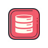
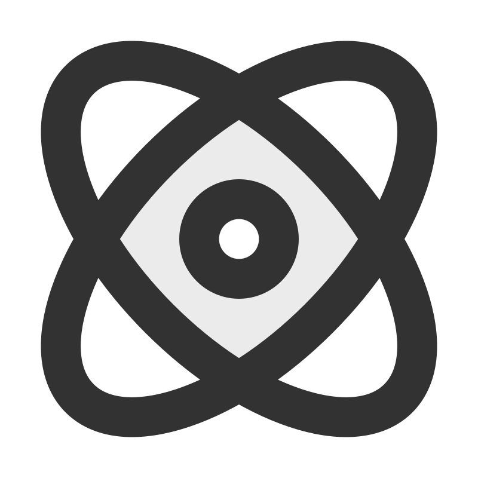

<a href="./README.md" title="Read in english">Inglés</a> · <strong>Español</strong><small> (actual)</small>
<br>
<br>
<details>
  <summary><span style="display:inline-flex;align-items:center;gap:8px;line-height:1;"><picture style="display:inline-block;margin:0">
    <source media="(prefers-color-scheme: dark)" srcset="assets/programming-code-signs-svgrepo-com-white.svg">
    <source media="(prefers-color-scheme: light)" srcset="assets/programming-code-signs-svgrepo-com.svg">
    
  </picture><picture style="display:inline-block;margin:0">
    <source media="(prefers-color-scheme: dark)" srcset="assets/summary-projects-es-white.svg">
    <source media="(prefers-color-scheme: light)" srcset="assets/summary-projects-es.svg">
    
  </picture></span></summary>

  <br>
  <table>
    <tbody>
      <tr>
        <td>
          <em><strong><a href="https://github.com/diegokoes/hsn-angular-node">HSN-Store</a></strong></em>
        </td>
        <td>
          
          <picture style="display:inline-block;margin:0">
            <source media="(prefers-color-scheme: dark)" srcset="https://cdn.simpleicons.org/express/ffffff">
            <source media="(prefers-color-scheme: light)" srcset="https://cdn.simpleicons.org/express/000000">
            
          </picture>
          
        </td>
      </tr>
      <tr>
        <td>
          <em><strong><a href="https://github.com/diegokoes/hsn-react-node">HSN-Store</a></strong></em>
        </td>
        <td>
          
          <picture style="display:inline-block;margin:0">
            <source media="(prefers-color-scheme: dark)" srcset="https://cdn.simpleicons.org/express/ffffff">
            <source media="(prefers-color-scheme: light)" srcset="https://cdn.simpleicons.org/express/000000">
            
          </picture>
          
        </td>
      </tr>
    </tbody>
  </table>
</details>

<details>
  <summary><span style="display:inline-flex;align-items:center;gap:8px;line-height:1;"><picture style="display:inline-block;margin:0">
    <source media="(prefers-color-scheme: dark)" srcset="assets/course-svgrepo-com-white.svg">
    <source media="(prefers-color-scheme: light)" srcset="assets/course-svgrepo-com.svg">
    
  </picture><picture style="display:inline-block;margin:0">
    <source media="(prefers-color-scheme: dark)" srcset="assets/summary-courses-es-white.svg">
    <source media="(prefers-color-scheme: light)" srcset="assets/summary-courses-es.svg">
    
  </picture></span></summary>

  <br>
  <table>
    <tr><th align="left">Curso</th><th align="left">Horas</th><th align="left">Descripción</th><th align="left">Estado</th></tr>
    <tr><td colspan="4" align="left"><strong>Coursera</strong></td></tr>
    <tr><td><em><strong><a href="https://github.com/diegokoes/Courses/tree/main/Coursera/Meta_Backend_Certificate/">Meta Backend Certificate</a></strong></em></td><td>196</td><td>
    <small>Django - SQL - Diseño de APIs RESTful</small>
    </td><td>En Progreso</td></tr>
    <tr><td colspan="4" align="left"><strong>Udemy</strong></td></tr>
    <tr><td><em><strong><a href="https://github.com/diegokoes/Courses/tree/main/Udemy/Angular_Complete_Guide">Angular — The Complete Guide</a></strong></em></td><td>56</td><td>Pipes, Inyección de Dependencias, Observables, Formularios, Databinding, Autenticación, Protección, Signals, Gestión de estado...</td><td>En Progreso</td></tr>
    <tr><td colspan="4" align="left"><strong>EDX</strong></td></tr>
    <tr><td><em><strong><a href="https://www.edx.org/learn/computer-science/the-linux-foundation-introduction-to-jenkins">Introducction to Jenkins</a></strong></em></td><td>30</td><td>Flujos de trabajo CI/CD usando servidor de automatización Jenkins</td><td>Completado</td></tr>
    <tr><td colspan="4" align="left"><strong><a href="https://github.com/diegokoes/Courses/tree/main/OpenWebinars">OpenWebinars</a></strong></td></tr>
  </table>
</details>

<details>
  <summary><span style="display:inline-flex;align-items:center;gap:8px;line-height:1;"><picture style="display:inline-block;margin:0">
    <source media="(prefers-color-scheme: dark)" srcset="assets/knowledge-graph-svgrepo-com-white.svg">
    <source media="(prefers-color-scheme: light)" srcset="assets/knowledge-graph-svgrepo-com.svg">
    
  </picture><picture style="display:inline-block;margin:0">
    <source media="(prefers-color-scheme: dark)" srcset="assets/summary-stack-es-white.svg">
    <source media="(prefers-color-scheme: light)" srcset="assets/summary-stack-es.svg">
    
  </picture></span></summary>
  <br>
  <table>
    <tr>
      <td><strong>Frontend</strong></td>
      <td style="display:flex;gap:16px;align-items:center;flex-wrap:wrap;">
        <span style="display:inline-flex;align-items:center;gap:4px;">
          
          <picture style="display:inline-block;margin:0">
            <source media="(prefers-color-scheme: dark)" srcset="assets/tech-angular-white.svg">
            <source media="(prefers-color-scheme: light)" srcset="assets/tech-angular.svg">
            
          </picture>
        </span>
        <span style="display:inline-flex;align-items:center;gap:4px;">
          
          <picture style="display:inline-block;margin:0">
            <source media="(prefers-color-scheme: dark)" srcset="assets/tech-react-white.svg">
            <source media="(prefers-color-scheme: light)" srcset="assets/tech-react.svg">
            
          </picture>
        </span>
                <span style="display:inline-flex;align-items:center;gap:4px;">
          
          <picture style="display:inline-block;margin:0">
            <source media="(prefers-color-scheme: dark)" srcset="assets/tech-tailwindcss-white.svg">
            <source media="(prefers-color-scheme: light)" srcset="assets/tech-tailwindcss.svg">
            
          </picture>
        </span>
      </td>
    </tr>
    <tr>
      <td><strong>Backend</strong></td>
      <td style="display:flex;gap:12px;align-items:center;flex-wrap:wrap;">
        <span style="display:inline-flex;align-items:center;gap:4px;">
          <picture style="display:inline-block;margin:0">
            <source media="(prefers-color-scheme: dark)" srcset="https://cdn.simpleicons.org/express/ffffff">
            <source media="(prefers-color-scheme: light)" srcset="https://cdn.simpleicons.org/express/000000">
            
          </picture>
          <picture style="display:inline-block;margin:0">
            <source media="(prefers-color-scheme: dark)" srcset="assets/tech-express-white.svg">
            <source media="(prefers-color-scheme: light)" srcset="assets/tech-express.svg">
            
          </picture>
        </span>
        <span style="display:inline-flex;align-items:center;gap:4px;">
          
          <picture style="display:inline-block;margin:0">
            <source media="(prefers-color-scheme: dark)" srcset="assets/tech-nodejs-white.svg">
            <source media="(prefers-color-scheme: light)" srcset="assets/tech-nodejs.svg">
            
          </picture>
        </span>
        <span style="display:inline-flex;align-items:center;gap:4px;">
          
          <picture style="display:inline-block;margin:0">
            <source media="(prefers-color-scheme: dark)" srcset="assets/tech-spring-white.svg">
            <source media="(prefers-color-scheme: light)" srcset="assets/tech-spring.svg">
            
          </picture>
        </span>
        <span style="display:inline-flex;align-items:center;gap:4px;">
          
          <picture style="display:inline-block;margin:0">
            <source media="(prefers-color-scheme: dark)" srcset="assets/tech-django-white.svg">
            <source media="(prefers-color-scheme: light)" srcset="assets/tech-django.svg">
            
          </picture>
        </span>
      </td>
    </tr>
    <tr>
      <td><strong>Bases de datos</strong></td>
      <td style="display:flex;gap:12px;align-items:center;flex-wrap:wrap;">
        <span style="display:inline-flex;align-items:center;gap:4px;">
          
          <picture style="display:inline-block;margin:0">
            <source media="(prefers-color-scheme: dark)" srcset="assets/tech-mongodb-white.svg">
            <source media="(prefers-color-scheme: light)" srcset="assets/tech-mongodb.svg">
            
          </picture>
        </span>
        <!-- <span style="display:inline-flex;align-items:center;gap:4px;">
          
          <picture style="display:inline-block;margin:0">
            <source media="(prefers-color-scheme: dark)" srcset="assets/tech-postgresql-white.svg">
            <source media="(prefers-color-scheme: light)" srcset="assets/tech-postgresql.svg">
            
          </picture>
        </span> -->
        <span style="display:inline-flex;align-items:center;gap:4px;">
          
          <picture style="display:inline-block;margin:0">
            <source media="(prefers-color-scheme: dark)" srcset="assets/tech-oracle-sql-white.svg">
            <source media="(prefers-color-scheme: light)" srcset="assets/tech-oracle-sql.svg">
            
          </picture>
        </span>
        <span style="display:inline-flex;align-items:center;gap:4px;">
          
          <picture style="display:inline-block;margin:0">
            <source media="(prefers-color-scheme: dark)" srcset="assets/tech-dbeaver-white.svg">
            <source media="(prefers-color-scheme: light)" srcset="assets/tech-dbeaver.svg">
            
          </picture>
        </span>
      </td>
    </tr>
    <tr>
      <td><strong>DevOps</strong></td>
      <td style="display:flex;gap:12px;align-items:center;flex-wrap:wrap;">
        <span style="display:inline-flex;align-items:center;gap:4px;">
          
          <picture style="display:inline-block;margin:0">
            <source media="(prefers-color-scheme: dark)" srcset="assets/tech-docker-white.svg">
            <source media="(prefers-color-scheme: light)" srcset="assets/tech-docker.svg">
            
          </picture>
        </span>
        <span style="display:inline-flex;align-items:center;gap:4px;">
          
          <picture style="display:inline-block;margin:0">
            <source media="(prefers-color-scheme: dark)" srcset="assets/tech-proxmox-white.svg">
            <source media="(prefers-color-scheme: light)" srcset="assets/tech-proxmox.svg">
            
          </picture>
        </span>
        <span style="display:inline-flex;align-items:center;gap:4px;">
          
          <picture style="display:inline-block;margin:0">
            <source media="(prefers-color-scheme: dark)" srcset="assets/tech-jenkins-white.svg">
            <source media="(prefers-color-scheme: light)" srcset="assets/tech-jenkins.svg">
            
          </picture>
        </span>
        <span style="display:inline-flex;align-items:center;gap:4px;">
          
          <picture style="display:inline-block;margin:0">
            <source media="(prefers-color-scheme: dark)" srcset="assets/tech-git-white.svg">
            <source media="(prefers-color-scheme: light)" srcset="assets/tech-git.svg">
            
          </picture>
        </span>
      </td>
    </tr>
  </table>
</details>
<details>
  <summary><span style="display:inline-flex;align-items:center;gap:8px;line-height:1;"><picture style="display:inline-block;margin:0">
    <source media="(prefers-color-scheme: dark)" srcset="assets/atom-svgrepo-com-white.svg">
    <source media="(prefers-color-scheme: light)" srcset="assets/atom-svgrepo-com.svg">
    
  </picture><picture style="display:inline-block;margin:0">
    <source media="(prefers-color-scheme: dark)" srcset="assets/summary-homelab-es-white.svg">
    <source media="(prefers-color-scheme: light)" srcset="assets/summary-homelab-es.svg">
    
  </picture></span></summary>
  <br>
  <table>
    <tbody>
      <tr>
        <td>
          <strong><a href="https://github.com/diegokoes/proxmox">proxmox</a></strong>
        </td>
        <td>Configuraciones y documentación relacionadas con Proxmox</td>
      </tr>
      <tr>
        <td>
          <strong><a href="https://github.com/diegokoes/dotfiles">dotfiles</a></strong>
        </td>
        <td>Mis dotfiles y la configuración del entorno</td>
      </tr>
      <tr>
        <td>
          <strong><a href="https://github.com/diegokoes/NOTES_programming">obsidian_programming</a></strong>
        </td>
        <td>Notas y vault de Obsidian sobre programación/tecnología</td>
      </tr>
      <tr>
        <td>
          <strong><a href="https://github.com/stars/diegokoes/lists/computer-installed">herramientas</a></strong>
        </td>
        <td>Lista personal de repos de software y utilidades que uso</td>
      </tr>
      <tr>
        <td>
          <strong><a href="https://github.com/stars/diegokoes/lists/wrench-interesting">interesantes</a></strong>
        </td>
        <td>Lista personal de repos que considero útiles o interesantes</td>
      </tr>
    </tbody>
  </table>
</details>

<details>
  <summary><span style="display:inline-flex;align-items:center;gap:8px;line-height:1;"><picture style="display:inline-block;margin:0">
    <source media="(prefers-color-scheme: dark)" srcset="assets/stats-chart-sharp-svgrepo-com-white.svg">
    <source media="(prefers-color-scheme: light)" srcset="assets/stats-chart-sharp-svgrepo-com.svg">
    
  </picture><picture style="display:inline-block;margin:0">
    <source media="(prefers-color-scheme: dark)" srcset="assets/summary-stats-es-white.svg">
    <source media="(prefers-color-scheme: light)" srcset="assets/summary-stats-es.svg">
    
  </picture></span></summary>
  <br>
<!--START_SECTION:waka_es-->
**Soy diurno 🐤** 

```text
🌞 Mañana  163 commits  ███░░░░░░░░░░░░░░░░░░░░░░   11.04 %
🌆 Día     588 commits  ██████████░░░░░░░░░░░░░░░   39.84 %
🌃 Tarde   527 commits  █████████░░░░░░░░░░░░░░░░   35.70 %
🌙 Noche   198 commits  ███░░░░░░░░░░░░░░░░░░░░░░   13.41 %```


📊 **Mi actividad semanal** 

```text
🕑︎ Time Zone: Europa/Madrid

💬 Lenguajes: 
Other                    9 hrs 3 mins        ███████░░░░░░░░░░░░░░░░░░   28.70 % 
TypeScript               6 hrs 56 mins       ██████░░░░░░░░░░░░░░░░░░░   22.00 % 
Markdown                 5 hrs 53 mins       █████░░░░░░░░░░░░░░░░░░░░   18.66 % 
Java                     3 hrs 5 mins        ██░░░░░░░░░░░░░░░░░░░░░░░   09.83 % 
YAML                     2 hrs 14 mins       ██░░░░░░░░░░░░░░░░░░░░░░░   07.10 % 

🔥 Editores: 
VS Code                  26 hrs 41 mins      █████████████████████░░░░   84.59 % 
Obsidian                 2 hrs 13 mins       ██░░░░░░░░░░░░░░░░░░░░░░░   07.04 % 
IntelliJ IDEA            1 hr 54 mins        ██░░░░░░░░░░░░░░░░░░░░░░░   06.07 % 
Unknown Editor           43 mins             █░░░░░░░░░░░░░░░░░░░░░░░░   02.30 % 

🐱‍💻 Proyectos: 
spfx-wiki-publisher      10 hrs 53 mins      █████████░░░░░░░░░░░░░░░░   34.52 % 
parallax-sports-spring   6 hrs 21 mins       █████░░░░░░░░░░░░░░░░░░░░   20.14 % 
Proyecto desconocido          3 hrs 10 mins       ███░░░░░░░░░░░░░░░░░░░░░░   10.04 % 
parallax-sports-ktor-micr2 hrs 37 mins       ██░░░░░░░░░░░░░░░░░░░░░░░   08.32 % 
parallax-sports-docs     1 hr 28 mins        █░░░░░░░░░░░░░░░░░░░░░░░░   04.67 % 

💻 Sistemas Operativos: 
Windows                  16 hrs 29 mins      █████████████░░░░░░░░░░░░   52.26 % 
Linux                    15 hrs 3 mins       ████████████░░░░░░░░░░░░░   47.74 % 
```


 Última actualización el 22/04/2026 00:14:35 UTC
<!--END_SECTION:waka_es-->
</details>
